  
  
  
  
   

  <em>I learn by testing real systems, rebuilding workflows, and refining setups — 
  then turning that experience into practical tools that others can actually reuse.</em>

---

## 🧭 About Me

From an early age, I was drawn to computing and electronics, even taking related courses along the way. Life eventually led me into a different branch of engineering, but Linux brought me back to that original curiosity.

A few years ago, after discovering creators like **Chris Titus Tech** and others in the Linux community, I started exploring Linux seriously in my spare time. Most of what I know has come from **self-learning, experimentation, and countless hours of rebuilding, testing, and refining**.

I am not a traditional software developer, and I do not come from a formal IT background. I am an enthusiast who **learns by doing**, studies how other people build their systems, and uses modern tools to turn useful ideas into practical projects.

---

## 💡 Why This GitHub Exists

This GitHub is where I share projects designed to make Linux **easier to understand, easier to experiment with, and easier to customize**.

A big part of that motivation comes from **helping family members** replicate useful setups, understand how Linux desktops are structured, and choose how they want their own computers to behave.

> **I do not build these projects to look like a developer.**  
> **I build them because they solve real problems for me, help the people around me, and hopefully make Linux more approachable for others too.**

---

## 🔧 What I Build

<table>
<tr>
<td width="50%" valign="top">

<h3>🚀 Core Focus</h3>

<ul>
  <li>Practical Linux tools for experimentation</li>
  <li>Reusable workflows for testing desktops</li>
  <li>Session-based profile management</li>
  <li>Learning-oriented customization utilities</li>
</ul>

</td>
<td width="50%" valign="top">

<h3>🎯 Design Philosophy</h3>

<ul>
  <li>Real-world use drives development</li>
  <li>Family support shapes features</li>
  <li>Hands-on iteration refines tools</li>
  <li>Approachability guides design</li>
</ul>

</td>
</tr>
</table>

---
## ⭐ Featured Project — isolated-desktops

  
  
  
  

**isolated-desktops** is a session-profile manager for testing multiple Linux desktop setups on one machine while keeping separate session homes and a cleaner workflow for reviewing plans, installing profiles, verifying setups, and opening editor workspaces.

### 🎯 Built for people who want to

<table>
<tr>
<td width="50%" valign="top">

<ul>
  <li>Test multiple desktop environments without mixing configurations</li>
  <li>Understand how Linux setups are structured</li>
  <li>Compare approaches before committing to one</li>
</ul>

</td>
<td width="50%" valign="top">

<ul>
  <li>Edit and refine real profiles more safely</li>
  <li>Experiment with more confidence</li>
  <li>Learn through hands-on iteration</li>
</ul>

</td>
</tr>
</table>

  

<strong>See another preview</strong>

 

  

---

## GitHub Stats

  
  

  
  

---

## 🎯 Current Focus

```mermaid
%%{init: {'theme':'base', 'themeVariables': { 'background':'#0D1117', 'primaryColor':'#0D1117', 'primaryBorderColor':'#00BFFF', 'primaryTextColor':'#D9FFFF', 'lineColor':'#00E5FF', 'secondaryColor':'#0D1117', 'tertiaryColor':'#0D1117' }, 'flowchart': { 'curve': 'stepBefore', 'htmlLabels': true }}}%%
flowchart TB
    CORE["VG CHIP<br/>Linux Desktop Experimentation"]:::chip

    subgraph BUS[" "]
      direction LR
      PM["Profile Management"]:::moduleB
      DA["Desktop Analysis"]:::moduleG
      TD["Tool Development"]:::moduleB
      CS["Community Support"]:::moduleG
    end

    CORE ==> PM
    CORE ==> DA
    CORE ==> TD
    CORE ==> CS

    PM --> PM1["Session isolation"]:::nodeB
    PM --> PM2["Config separation"]:::nodeB
    PM --> PM3["Safe testing"]:::nodeB

    DA --> DA1["Structure study"]:::nodeG
    DA --> DA2["Workflow comparison"]:::nodeG
    DA --> DA3["Best practices"]:::nodeG

    TD --> TD1["Reusable scripts"]:::nodeB
    TD --> TD2["Modular design"]:::nodeB
    TD --> TD3["Documentation"]:::nodeB

    CS --> CS1["Family guidance"]:::nodeG
    CS --> CS2["New user help"]:::nodeG
    CS --> CS3["Knowledge sharing"]:::nodeG

    classDef chip fill:#07131A,stroke:#39FF14,stroke-width:4px,color:#D9FFFF;
    classDef moduleB fill:#0D1117,stroke:#00BFFF,stroke-width:3px,color:#A7FFF4;
    classDef moduleG fill:#0D1117,stroke:#39FF14,stroke-width:3px,color:#D9FFF1;
    classDef nodeB fill:#0D1117,stroke:#00E5FF,stroke-width:2px,color:#BFFCFF;
    classDef nodeG fill:#0D1117,stroke:#00FF9C,stroke-width:2px,color:#D9FFF1;
    linkStyle default stroke:#00D9FF,stroke-width:2px;
```

<table>
<tr>
<td width="25%" valign="top">

<ul>
  <li>Profile-based workflows</li>
  <li>Multi-desktop testing</li>
  <li>Safer customization</li>
  <li>Cleaner iteration cycles</li>
</ul>

</td>
<td width="25%" valign="top">

<ul>
  <li>Reusable setup logic</li>
  <li>Modular structure</li>
  <li>Clear documentation</li>
  <li>Practical automation</li>
</ul>

</td>
<td width="25%" valign="top">

<ul>
  <li>Study real desktop structures</li>
  <li>Compare workflows</li>
  <li>Keep what works</li>
  <li>Refine what matters</li>
</ul>

</td>
<td width="25%" valign="top">

<ul>
  <li>Family-friendly learning</li>
  <li>New-user guidance</li>
  <li>Shareable setups</li>
  <li>Community-minded tools</li>
</ul>

</td>
</tr>
</table>

---

## 🚀 Long-term Vision

I want this GitHub to grow into a collection of practical tools that help people:

  <strong>Explore Linux → Understand design choices → Build their own setups → Gain confidence</strong>

The goal is simple: make Linux customization feel less overwhelming, so new users can experiment safely and gradually shape a desktop that fits the way they actually work.

---

## 🌱 My Approach to Customization

<table>
<tr>
<td width="25%" valign="top">

<h3>1️⃣ Study</h3>

Analyze how others structure their setups

</td>
<td width="25%" valign="top">

<h3>2️⃣ Adapt</h3>

Extract what is genuinely useful

</td>
<td width="25%" valign="top">

<h3>3️⃣ Refine</h3>

Build something cleaner and reusable

</td>
<td width="25%" valign="top">

<h3>4️⃣ Share</h3>

Document it so others can learn

</td>
</tr>
</table>

> I am especially interested in making Linux customization approachable, so new users can experiment with confidence and gradually build something that is truly their own.

---

## 📫 Connect & Collaborate

---

### 💙 Thanks for visiting!

Built with passion for Linux experimentation and community learning 🐧

<!--
**Vguver/Vguver** is a ✨ _special_ ✨ repository because its `README.md` (this file) appears on your GitHub profile.

Here are some ideas to get you started:

- 🔭 I’m currently working on ...
- 🌱 I’m currently learning ...
- 👯 I’m looking to collaborate on ...
- 🤔 I’m looking for help with ...
- 💬 Ask me about ...
- 📫 How to reach me: ...
- 😄 Pronouns: ...
- ⚡ Fun fact: ...
-->
