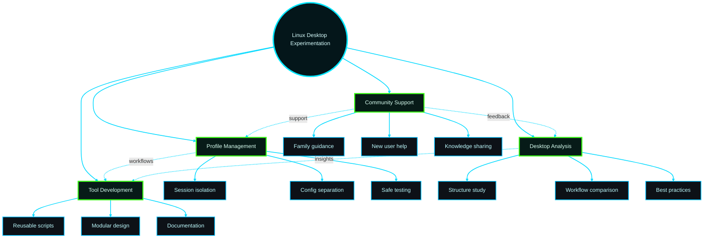

  
  
  
  

<strong>I learn by testing real systems, rebuilding workflows, and refining setups</strong>

Then I turn that experience into practical tools that others can actually reuse.

---

## About Me

From an early age, I was drawn to computing and electronics, even taking related courses along the way. Life eventually led me into a different branch of engineering, but Linux brought me back to that original curiosity.

A few years ago, after discovering creators like Chris Titus Tech and others in the Linux community, I started exploring Linux seriously in my spare time. Most of what I know has come from self-learning, experimentation, and countless hours of rebuilding, testing, and refining.

I am not a traditional software developer, and I do not come from a formal IT background. I am an enthusiast who learns by doing, studies how other people build their systems, and uses modern tools to turn useful ideas into practical projects.

---

## Why This GitHub Exists

This GitHub is where I share projects designed to make Linux easier to understand, easier to experiment with, and easier to customize.

A big part of that motivation comes from helping family members replicate useful setups, understand how Linux desktops are structured, and choose how they want their own computers to behave.

> I do not build these projects to look like a developer.  
> I build them because they solve real problems for me, help the people around me, and hopefully make Linux more approachable for others too.

---

## What I Build

### Core Focus
- Practical Linux tools for experimentation
- Reusable workflows for testing desktops
- Session-based profile management
- Learning-oriented customization utilities

### Design Philosophy
- Real-world use drives development
- Family support shapes features
- Hands-on iteration refines tools
- Approachability guides design

---

## Featured Project — isolated-desktops

  
  
  
  

**isolated-desktops** is a session-profile manager for testing multiple Linux desktop setups on one machine while keeping separate session homes and a cleaner workflow for analysis, installation, verification, and iteration.

### Built for people who want to
- test multiple desktop environments without mixing configurations
- understand how Linux setups are structured
- compare approaches before committing to one
- edit and refine real profiles more safely
- learn through hands-on experimentation

  

<strong>See another project preview</strong>

 

  

---

## GitHub Stats

  
  

  

---

## GitHub Stats

  
  

  
  

---
## Current Focus

<table>
<tr>
<td width="33%">

### Experimentation
- Profile-based workflows
- Multi-desktop testing
- Safer customization

</td>
<td width="33%">

### Development
- Reusable setup logic
- Modular structure
- Clear documentation

</td>
<td width="33%">

### Learning
- New-user friendly tools
- Practical experimentation
- Hands-on understanding

</td>
</tr>
</table>

## Current Focus

- 🔬 Profile-based workflows for safer Linux desktop testing
- 🧩 Reusable setup logic that can be refined over time
- 🖥️ Desktop experimentation without mixing configurations
- 📚 Learning-oriented tools that help new users understand how Linux setups work
- 🤝 Practical projects shaped by teaching, iteration, and family support

---

## Long-Term Vision

I want this GitHub to grow into a collection of practical tools that help people:

**Explore Linux → Understand design choices → Build their own setups → Gain confidence**

The goal is simple: make Linux customization feel less overwhelming, so new users can experiment safely and gradually shape a desktop that fits the way they actually work.

---

## My Approach to Customization

1. **Study** how other people structure their setups  
2. **Adapt** what is genuinely useful  
3. **Refine** it into something cleaner and more reusable  
4. **Share** it so others can learn from the process  

> I am especially interested in making Linux customization approachable, so new users can experiment with confidence and gradually build something that is truly their own.

---

## Connect & Collaborate

---

### 💙 Thanks for visiting!

Built with passion for Linux experimentation and community learning 🐧

<!--
**Vguver/Vguver** is a ✨ _special_ ✨ repository because its `README.md` (this file) appears on your GitHub profile.

Here are some ideas to get you started:

- 🔭 I’m currently working on ...
- 🌱 I’m currently learning ...
- 👯 I’m looking to collaborate on ...
- 🤔 I’m looking for help with ...
- 💬 Ask me about ...
- 📫 How to reach me: ...
- 😄 Pronouns: ...
- ⚡ Fun fact: ...
-->
