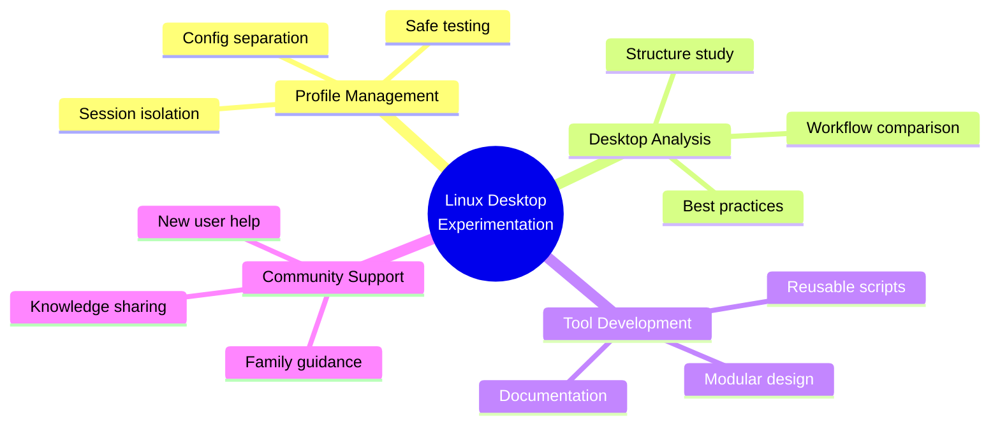

<div align="center">

[](https://git.io/typing-svg)

<p>
  
  
  
  
</p>

<p>
  <em>I learn by testing real systems, rebuilding workflows, and refining setups ;<br/>
  then turning that experience into practical tools that others can actually reuse.</em>
</p>

</div>

---

## 🧭 About Me

From an early age, I was drawn to computing and electronics, even taking related courses along the way. Life eventually led me into a different branch of engineering, but Linux brought me back to that original curiosity.

A few years ago, after discovering creators like **Chris Titus Tech** and others in the Linux community, I started exploring Linux seriously in my spare time. Most of what I know has come from **self-learning, experimentation, and countless hours of rebuilding, testing, and refining**.

I'm not a traditional software developer, and I don't come from a formal IT background. I'm an enthusiast who **learns by doing**, studies how other people build their systems, and uses modern tools to turn useful ideas into practical projects.

---

## 💡 Why This GitHub Exists

This GitHub is where I share projects designed to make Linux **easier to understand, easier to experiment with, and easier to customize**.

A big part of that motivation comes from **helping family members** replicate useful setups, understand how Linux desktops are structured, and choose how they want their own computers to behave.

> **I don't build these projects to look like a developer.**  
> **I build them because they solve real problems for me, help the people around me, and hopefully make Linux more approachable for others too.**

---

## 🔧 What I Build

<table>
<tr>
<td width="50%">

### 🚀 Core Focus
- Practical Linux tools for experimentation
- Reusable workflows for testing desktops
- Session-based desktop managers
- Learning-oriented customization utilities

</td>
<td width="50%">

### 🎯 Design Philosophy
- Real-world use drives development
- Family support shapes features
- Hands-on iteration refines tools
- Approachability guides design

</td>
</tr>
</table>

---

## ⭐ Featured Project — isolated-desktops

<div align="center">

<a href="https://github.com/Vguver/isolated-desktops">
  
</a>

<p>
  
  
  
  
</p>

</div>

**isolated-desktops** is a session-profile manager for testing multiple Linux desktop setups on one machine while keeping separate session homes and a cleaner workflow for analysis, installation, verification, and iteration.

### 🎯 Built for people who want to:

<table>
<tr>
<td width="50%">

✅ Test multiple desktop environments without mixing configs  
✅ Understand how Linux setups are structured  
✅ Compare approaches before committing

</td>
<td width="50%">

✅ Edit and refine real profiles safely  
✅ Experiment with confidence  
✅ Learn through hands-on iteration

</td>
</tr>
</table>

<div align="center">
  
</div>

---

## 📊 GitHub Activity & Stats

<div align="center">

### 📈 Contribution Overview

<table>
<tr>
<td width="50%">


</td>
<td width="50%">


</td>
</tr>
</table>

### 💻 Language Distribution & Activity

<table>
<tr>
<td width="50%">


</td>
<td width="50%">


</td>
</tr>
</table>

### 📅 Detailed Contribution Timeline


### 🏆 GitHub Achievements


</div>

---

## 🎯 Current Focus


<div align="center">



</div>

<table>
<tr>
<td width="33%">

### 🔬 Experimentation
- Profile-based workflows
- Multi-desktop testing
- Safe customization

</td>
<td width="33%">

### 🛠️ Development
- Reusable setup logic
- Modular architecture
- Clear documentation

</td>
<td width="33%">

### 📚 Education
- Learning-focused tools
- Practical tutorials
- Real-world examples

</td>
</tr>
</table>

---

## 🚀 Long-term Vision

I want this GitHub to grow into a **collection of practical tools** that help people:

<div align="center">

```
🔍 Explore Linux → 💡 Understand design choices → 🛠️ Build their own setups → 💪 Gain confidence
```

</div>

The goal is simple: **make Linux customization feel less overwhelming**, so new users can experiment safely and gradually shape a desktop that fits the way they actually work.

---

## 🌱 My Approach to Customization

<table>
<tr>
<td width="25%">

### 1️⃣ Study
Analyze how others structure their setups

</td>
<td width="25%">

### 2️⃣ Adapt
Extract what's genuinely useful

</td>
<td width="25%">

### 3️⃣ Refine
Build something cleaner and reusable

</td>
<td width="25%">

### 4️⃣ Share
Document for others to learn from

</td>
</tr>
</table>

> I'm especially interested in making Linux customization approachable, so new users can experiment with confidence and gradually build something that's truly their own.

---

## 📫 Connect & Collaborate

<div align="center">

<a href="https://github.com/Vguver">
  
</a>

<a href="https://github.com/Vguver/isolated-desktops">
  
</a>

</div>

---

<div align="center">

### 💙 Thanks for visiting!


<sub>Built with passion for Linux experimentation and community learning 🐧</sub>

</div>


<!--
**Vguver/Vguver** is a ✨ _special_ ✨ repository because its `README.md` (this file) appears on your GitHub profile.

Here are some ideas to get you started:

- 🔭 I’m currently working on ...
- 🌱 I’m currently learning ...
- 👯 I’m looking to collaborate on ...
- 🤔 I’m looking for help with ...
- 💬 Ask me about ...
- 📫 How to reach me: ...
- 😄 Pronouns: ...
- ⚡ Fun fact: ...
-->
